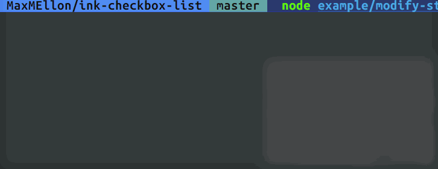

# Ink-checkbox-list [](https://travis-ci.org/MaxMEllon/ink-checkbox-list) [](https://github.com/sindresorhus/xo)

> Checkbox list component for [Ink](https://github.com/vadimdemedes/ink)

Demo
---




Install
---

```
$ npm install ink ink-checkbox-list
```

Key bindings
---

| key | action |
|---|---|
| `<Space>` | toggle check/uncheck |
| `<Enter>` | deside item list |
| `<Up>` | move to up a cursor |
| `<Down>` | move to down a cursor |

Usage
---

```js
const { h, mount } = require('ink')
const { List, ListItem } = require('ink-checkbox-list')

let component

const unmount = mount(
  h(List, {
    ref: (co) => (component = co),
    onDeside: () => {
      console.log(component.getCheckedItem())
      process.exit(0)
    }
  }, [
    h(ListItem, {}, 'aaaa'),
    h(ListItem, {}, 'aaaa'),
    h(ListItem, {}, 'aaaa'),
    h(ListItem, {}, 'aaaa'),
    h(ListItem, {}, 'aaaa')
  ])
);
```

> when using jsx

```js
const { h, mount } = require('ink')
const { List, ListItem } = require('ink-checkbox-list')

let component

const unmount = mount(
  <List
    ref={co => component}
    onDeside: () => {
      console.log(component.getCheckedItem())
      process.exit(0)
    }
  >
    <ListItem>aaaa</ListItem>
    <ListItem>aaaa</ListItem>
    <ListItem>aaaa</ListItem>
    <ListItem>aaaa</ListItem>
  </List>
);
```

**Note**:

Use this snippet to enable `keypress` events:

```js
const readline = require('readline');

readline.emitKeypressEvents(process.stdin);
process.stdin.setRawMode(true);
```

## Props

### checkedChar

Type: `string`

Default: `⦿`

### nocheckedChar

Type: `string`

Default: `○`

### cursorChar

Type: `string`

Default: `>`

LICENSE
---

MIT © 2017 MaxMellon
