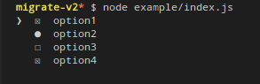

# Ink-checkbox-list [](https://travis-ci.org/MaxMEllon/ink-checkbox-list) [](https://github.com/sindresorhus/xo)

> Checkbox list component for [Ink](https://github.com/vadimdemedes/ink)

Demo
---



Install
---

```
$ npm install ink-checkbox-list
```

Key bindings
---

| key | action |
|---|---|
| <kbd>Space</kbd>| toggle check/uncheck |
| <kbd>Enter</kbd>| submit item list |
| <kbd>↑</kbd>| move to up a cursor |
| <kbd>↓</kbd>| move to down a cursor |

Usage
---

```js
const {h, mount} = require('ink');
const {List, ListItem} = require('ink-checkbox-list');

const unmount = mount(
	<List
		onSubmit={(list) => {
			console.log(list)
			process.exit(0);
		}}
	>
		<ListItem>aaaa</ListItem>
	</List>
);

setTimeout(() => {
	unmount();
	process.exit(1);
}, 10000);
```

**Note**:

Use this snippet to enable `keypress` events:

```js
const readline = require('readline');

readline.emitKeypressEvents(process.stdin);
process.stdin.setRawMode(true);
```

## Props

### checkedChar

Type: `string`

Default: `☒`

This character is used checked component.

### nocheckedChar

Type: `string`

Default: `☐`

This character is used unchecked component.

### cursorChar

Type: `string`

Default: `❯`

This character is used current cursor line.

### onChange

Type: `Function`

Function to call when user `check`. (<kbd>Space</kbd>)

### onSubmit

Type: `Function`

Function to call when user `submit`. (<kbd>Enter</kbd>)

LICENSE
---

MIT © 2017 MaxMellon
